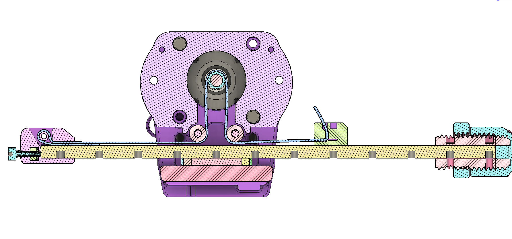

## General Safety 
- We’ve worked to make building an OSSM easy and not require expert level knowledge. With that said, only you can be responsible for your safety. If you are unsure about something, find a resource, ask the discord, or just pause for a minute before rushing into it. This is a DIY project, and everyone’s build is a bit different – so make sure you are comfortable with your setup and understand how it works! 
## Electrical Safety 
- 24V is generally considered a fairly safe, low voltage, but always be careful to check wiring polarity and make sure nothing conductive is near the board or power supply that could cause a short circuit. 
## Mechanical Safety
- There are some pinch points in the OSSM near the rail – keep sensitive bits away from that during use! 
- Depending on your motor selection, the OSSM can generate quite a bit of force, and that can hurt if it’s not applied in the right way, especially in delicate orifices! Always be able to move away from the machine if needed, or have someone specifically responsible for your safety if using it with a partner. Everyone has their own level or risk tolerance, so make sure you understand how your setup works, and give consideration to what you would do should something go wrong. 

This is an open-source, community based project. Lots of people contribute to its success which is a huge strength for developing quickly! It also means we are not responsible for the complete safety of the design. Play risk-aware and consensually!

## Parts
Check out the [BOM](bom.md) for detailed information about the parts you may need.

# Instructions!
### Mate the Base Plate with the Motor 
Attach the OSSM base plate to the motor with (2) 5x20mm cap head screws in the locations marked M5 and tighten with a M5 nut below the motor mounting flange. The nut is usually kept from turning by the motor body. If it spins when tightening, insert a flat head screwdriver between the nut and motor to keep it in place.

## Build up the Idler Bearings
Stack three 5x11x4mm bearings on a 5x20mm cap head bolt and attach to the printed threads in the baseplate, as shown below. They do not need to be tight, just snugged down. the bolts are acting in double sheer, not tension.

## Install and align the pulley
Slide the 20 tooth GT2 pulley onto the shaft of the motor. It should move easily. Align one of the set screws with the flat of the motor and tighten down very gently. 

Align the pulley as shown below and snug the set screw. Do not tighten it down completely at this time.

## Install the Liner Rail
**Be careful not to separate bearing from linear rail, there is a chance of losing ball bearings when the rail and bearing are separated! The image below has the rail removed for clarity, do not remove your rail from the carriage.**

Install 4 M3x10mm socket cap bolts through the base and into the carriage. Threadlocker such as Loctite 242 is recommended.

With the rail now installed, align the toothed portion of the pulley with the rail and tighten down both set screws. Threadlocker such as Loctite 242 is highly recommended.
## Install Mid Body

The mid body is placed on top of the base and attached to the motor with 2 M5x35mm bolts and nuts. The Mid body captures the tops of the bearing bolts and adds the final two bolts to the motor.
## Alternative Mid body 
The middle pivot design makes it easier to bolt your ossm directly onto extrusion. It can be mounted using 4x M5x35 screws and 4x M5 nuts as shown below.

Here all 4 bolts go through the motor, ossm base, and ossm mid body.

## Belt Routing
Pay special attention to this section. It can be difficult to get the routing and clamping correct. Correct completion of this section is essential to proper OSSM operation. 
Below is an overview of the final configuration of the belt.

- Belt is shown in BLUE
- The teeth on the belt are not shown, but should face the pulley.
## Tensioner
The first thing you should do is place the belt into the tensioner.
Fold the belt in half with the teeth facing towards each other. Work each end in from the top following the green arrows below.

Pull the belt until the lower piece has only a small section sticking out from the tensioner.

Then slip the assembly onto the end of the rail.

Drop an M5 nut into the slot and thread in an M5x16 bolt into it.
Do not tighten the M5 bolt at this point. The result should look like below with the teeth on the top belt facing down

## Threading the belt into the body
Wrapping the belt around the main drive pully and past the stacks of idler pulleys will get the belt in the correct location. The teeth of the belt should mesh with the teeth on the pulley.

## Fixed belt end
- The belt routes through the slot in the top belt clamp. Insert the M3x20 screw from  the bottom of the rail, through the clamp bottom (with teeth up engaging the belt), and engage the nut in the top clamp.
- Before you tighten the screw fully, pull the remaining belt slack so it is snug.
- Tighten the screw to secure the belt.
- Trim remaining belt (if you are sure you are happy with stroke length!)

With the belt now routed, gently move the linear rail back and forth, ensuring the belt tracks on the pulley without rubbing and the system moves smoothly and easily. 
## Tensioning the belt
Using the tensioner M5 bolt, increase the tension on the OSSM belt. Tension should only be increased if the system slips under load. 

**Too much force can damage the motor**

# FIN
Your OSSM should be completely assembled from a hardware perspective at this point. Now it's time to set up the [Electroncis](electronics.md) and the [Mounting](../mounting/index.md)
