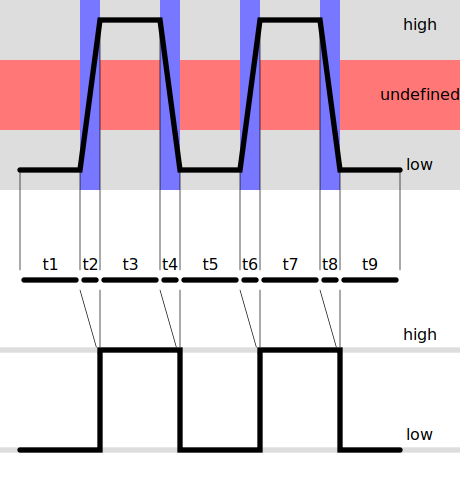

# Pulse and Direction
The OSSM communicates from the control board to the motor using two distinct logic signals, Pulse and Direction.
### Pulse (PUL)
On the rising edge of the pulse signal (t2 and t6 in the below graphic) from the OSSM board to the motor, the motor advances one step. The default setting for the OSSM is 800 steps per revolution, or 0.45 degrees per step. In the standard design, each rotation of the pulley moves the rail 40mm (20 teeth, 2mm pitch) or 0.05mm per step. In order to move the system at 1m/s, the pulse train approaches 20khz.

### Direction (DIR)
The magic of the OSSM is in the ability to change direction at any point in the motion, meaning depth and stroke length are independently adjustable. When the Direction or DIR pin is pulled high, the motor rotates 1 step in a certain direction each time the PUL pin is pulled high. When the DIR pin is pulled low, the motor rotates 1 step in the opposite direction each time the PUL pin is pulled high.
# Sensorless Homing
Homing using microswitches is fairly simple. The Machine moves in one direction until the limit switch is triggered. It marks this as one end of the rail. The other end can either be detected using a second limit switch or the system can use a fixed rail length in code. Sensorless homing is similar but removes the need for limit switches that can fall out of rig, fail to trigger or trigger prematurely. 
Sensorless homing is a slight misnomer as the system uses a shunt resistor and current sensor to determine how much power the motor is drawing during the homing sequence. When the system encounters a hard stop, the motor current will suddenly rise very quickly. The firmware captures this event and sets the current position as one end of the rail, much the same as using a limit switch. However unlike a limit switch, the same current sensor can be used to detect the other end of the rail as well. This means that the system is able to home to both ends without the need for any external sensors. There is one downside, however, sensorless homing does require power to flow through the OSSM control board.