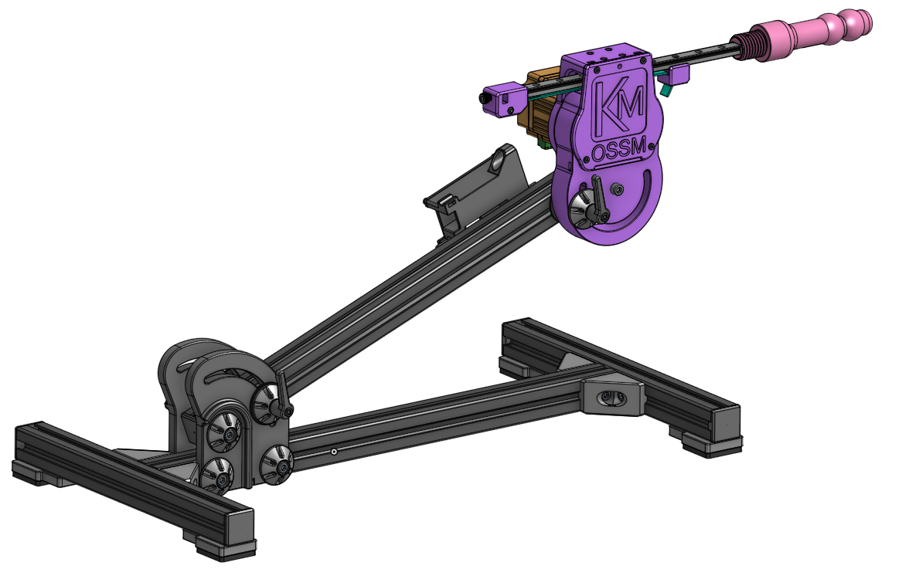
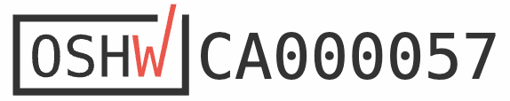
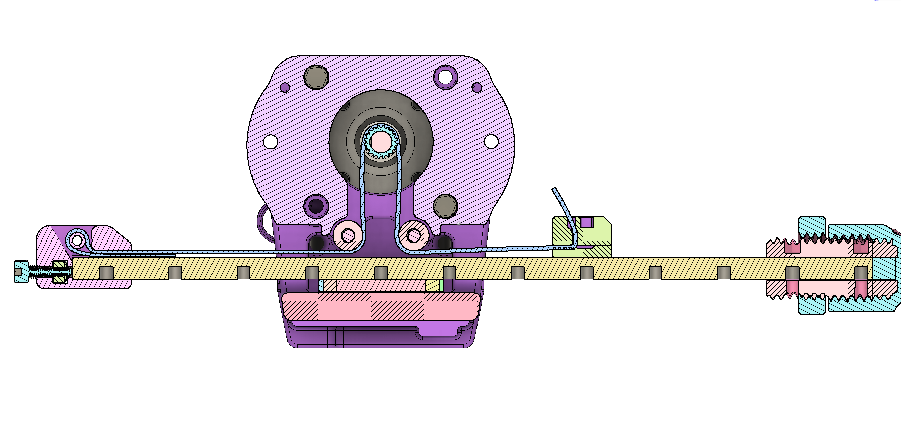
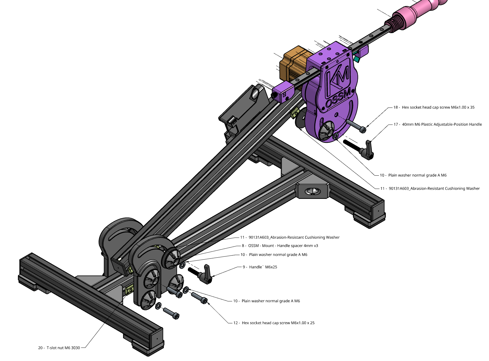

# Welcome to the Unofficial OSSM Documentation
### Kinky Makers Discord 

OSSM (pronounced like "Awesome") is a user friendly every day sex machine for the people.

This project aims to help people curious about sex machines explore their interest. A second objective is optionally learning how mechanics, electronics, physics and computing are involved in your sexual pleasure.

Please note that this is a _work in progress_ and we have attempted to keep compatibility with the current BOM going forward, but it's not guaranteed.

_Our Primary design goals_ are to make a machine that is compact, quiet, of moderate cost, 3D printable (no cutting/machining required), flexible, highly performant, with easily sourced components, and doesn't look like a giant machine.

### Is it actually Open Source?

It is one of a kind Certified, Actual, Factual, Open Source as certified by the Open Source Hardware Association

## Getting Started

### [Read the Frequently Asked Questions](faq.md)

### [Build Instructions](assembly/hardware_assembly.md)

### [Build Videos]("https://youtube.com/playlist?list=PLzSK7OAu3KNQsFo6WJGT8P28lfkD3xpps")

[Join our Discord](https://discord.gg/MmpT9xE) to be part of the discussion and get help with your build. We have a huge community of makers!
### Software

The software is available in the [github repository](https://github.com/KinkyMakers/OSSM-hardware/). It is written and compiled utilizing PlatformIO on Visual Studio Code. [Reference for working with the code in PlatformIO here](software/PlatformIO.md)

We recommend using the [Research and Desire Reference Board](https://shop.researchanddesire.com/products/ossm-reference-board) as Do It Yourself by someone without extensive electronics knowledge creates a lot of support overhead. This code is still
arduino IDE compatible but offers many times better performance. Web based control is projected to be available in Feb 2025.  
### Mechanical design

The OSSM use a compact belt design with components that have become widely available due to 3D printing popularity. 

### Mounting

Mounting designs can be found [here](mounting/index.md)

### Safety

The safety of the OSSM build is yet to be fully characterized as it is a work in progress. The OSSM is a framework for building your own sex machine and as such your specific combination may have risks not inherent to other builds. These risks may be undocumented or undiscovered. Please see the [Safety Documentation](safety.md) for more information.

While using the OSSM we can suggest the following hierarchy of safety, however it is up to you and your build to decide
what risks exist and how to mitigate them.

1. Have ability to move away
2. Have ability to remove the power
3. If you are in bondage, safety is responsibility of the Top